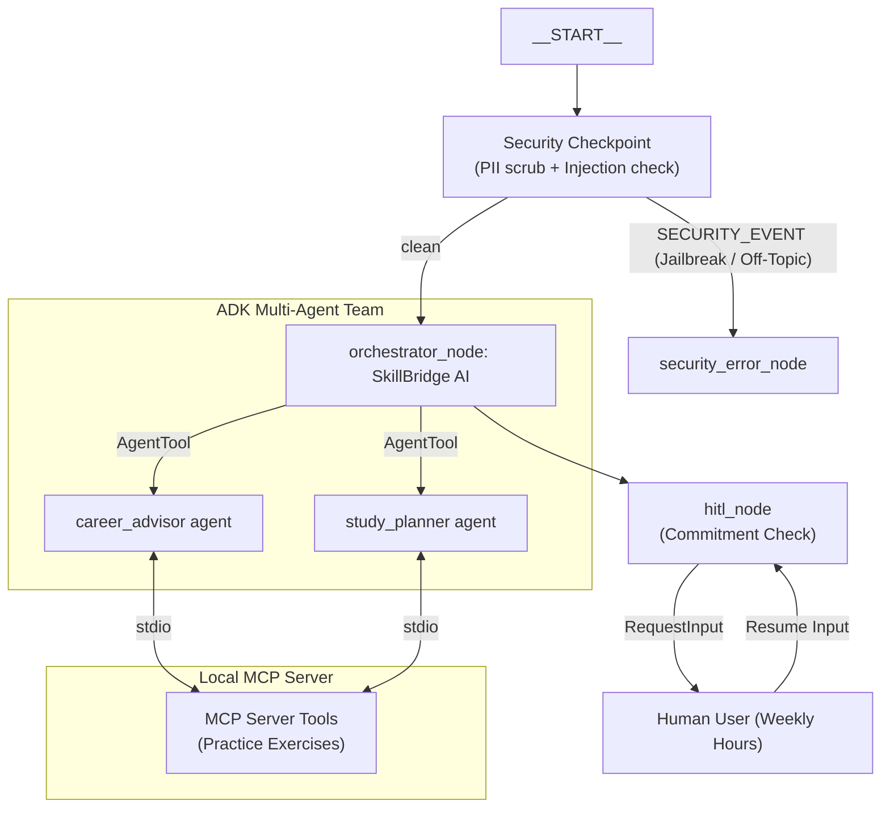

# SkillBridge AI — Submission Write-Up

## Problem Statement
Many students and early professionals struggle to successfully transition from academic studies to industry-ready careers. They face information overload, unclear roadmap options, difficulty identifying skill gaps for competitive roles, and lack of real-time practice exercises. Standard chatbots give generic recommendations, while human mentoring is expensive and hard to scale. SkillBridge AI solves this by acting as a personalized, state-aware career mentor that identifies skill gaps and structures customized weekly curricula.

---

## Solution Architecture

---

## Concepts Used & File References

- **ADK Workflow**: Implemented as a graph-based state machine in [agent.py](file:///c:/Users/indla%20joelpramod/OneDrive/Desktop/adk-workspace/skillbridge-ai/app/agent.py#L159-L170). The graph defines deterministic routing rules between function nodes.
- **LlmAgent / Agent**: Three specialized agents (`orchestrator`, `career_advisor`, `study_planner`) configured in [agent.py](file:///c:/Users/indla%20joelpramod/OneDrive/Desktop/adk-workspace/skillbridge-ai/app/agent.py#L19-L58).
- **AgentTool**: Enables the orchestrator agent to delegate sub-tasks to the advisor and planner agents, defined in [agent.py](file:///c:/Users/indla%20joelpramod/OneDrive/Desktop/adk-workspace/skillbridge-ai/app/agent.py#L54-L57).
- **MCP Server**: Implemented using FastMCP in [mcp_server.py](file:///c:/Users/indla%20joelpramod/OneDrive/Desktop/adk-workspace/skillbridge-ai/app/mcp_server.py).
- **Security Checkpoint**: The front-gate node (`security_checkpoint`) in [agent.py](file:///c:/Users/indla%20joelpramod/OneDrive/Desktop/adk-workspace/skillbridge-ai/app/agent.py#L78-L126).
- **Agents CLI**: Scaffolding, installation, and playground UI configurations configured via [Makefile](file:///c:/Users/indla%20joelpramod/OneDrive/Desktop/adk-workspace/skillbridge-ai/Makefile).

---

## Security Design

1. **Prompt Injection Protection**: Keyword analysis intercepts jailbreak payloads (e.g. `ignore previous instructions`), outputting a `"SECURITY_EVENT"` route to lock the session. This prevents prompt manipulation of our mentoring models.
2. **PII Scrubbing**: Regex filters automatically scan user inputs/resume copy to replace phone numbers and email addresses with redacted tags. This ensures user privacy is protected before tokens are dispatched to remote LLM endpoints.
3. **Structured JSON Audit Logs**: The checkpoint prints structured JSON strings indicating the severity, type of violation (if any), and input preview. This provides enterprise-grade observability and security compliance.
4. **Domain-Specific Filter**: Blocks off-topic queries related to politics, gossip, or gaming cheat codes to ensure the mentoring model remains focused on career coaching.

---

## MCP Server Design

Our Model Context Protocol (MCP) server runs as a separate process over stdio transport and exposes 4 key tools:
1. `search_courses_and_certifications`: Searches database catalogs for recommended beginner to advanced courses/certs.
2. `get_skill_requirements`: Returns precise technical and soft skill sets for software engineering, cybersecurity, data science, etc.
3. `get_job_market_insights`: Provides salary expectations and current demand ratings globally or by country.
4. `generate_practice_exercise`: Yields specialized interview questions or coding challenges on demand.

---

## Human-In-The-Loop (HITL) Flow

A common problem with automated planners is that they generate unrealistic schedules (e.g. demanding 40 hours of study from a student already taking full-time classes). 

To prevent this, the `hitl_node` monitors roadmap queries. If the user requests a roadmap, the workflow interrupts and issues a `RequestInput` asking: `"how many hours per week can you dedicate to study?"`. 
The workflow blocks until the user replies. When the response is received, the node rehydrates the state with the hours commitment, executes the `study_planner` agent, and returns a realistic curriculum.

---

## Demo Walkthrough

1. **Case 1: Career Skill Analysis**: The user greets the agent and asks: `"I want to become an AI Engineer. What skills do I need?"`. The request routes to the career advisor who uses MCP tools to return technical requirements.
2. **Case 2: Security Block**: The user enters an off-topic/injection string. The checkpoint catches the violation, prints a CRITICAL JSON audit log, and outputs the security warning message.
3. **Case 3: Custom Study Plan (HITL)**: The user asks for a roadmap to learn Python. The system pauses to ask for weekly study hours. The user enters `15`. The planner yields a realistic 15-hour weekly study schedule.

---

## Impact / Value Statement

SkillBridge AI bridges the gap between academics and the workplace. It empowers:
- **Self-learners** to acquire market-relevant skills systematically.
- **Students** to make informed career decisions and choose the right certifications.
- **Bootcamp graduates** to practice domain-specific exercises.

By scaling personalized career mentoring to anyone with an internet connection, SkillBridge AI makes career growth accessible and secure.
